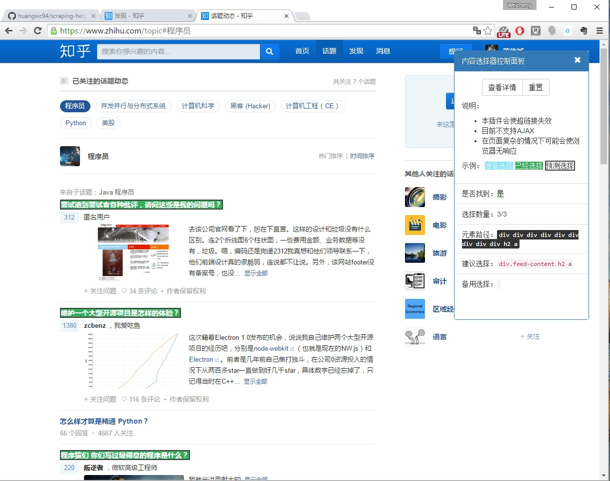
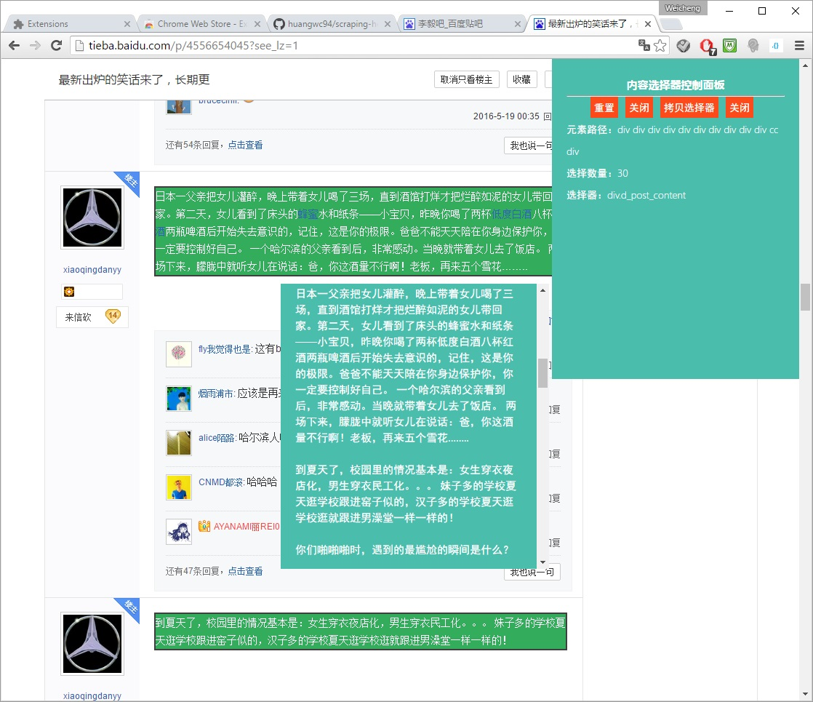
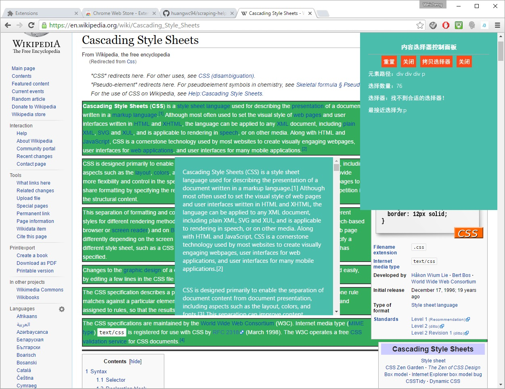

https://chrome.google.com/webstore/detail/%E6%95%B0%E6%8D%AE%E6%8A%93%E5%8F%96%E5%88%86%E6%9E%90%E5%B7%A5%E5%85%B7/kmghfpaenbmakjffjhjncacmhagadgbg?hl=zh-CN
Version：0.3 Alpha
# 数据抓取分析助手 (Chrome插件版)
### 根据选择元素，自动生成最简HTML选择命令，用于爬虫网页内容分析
## 功能：
* 根据选择的元素，自动计算相应的 Jquery selector， 并可以直接用于 python BeautifulSoup等package
* 根据选择的元素，提取文本内容
*

  
  
  

本软件版权为 MIT LICENSE  
Contributor LordBread
