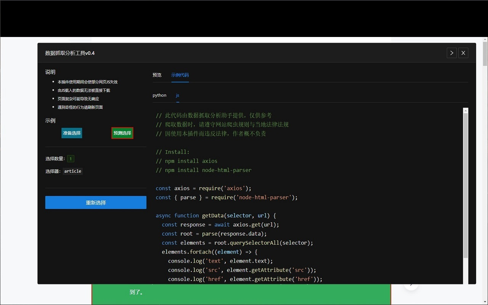
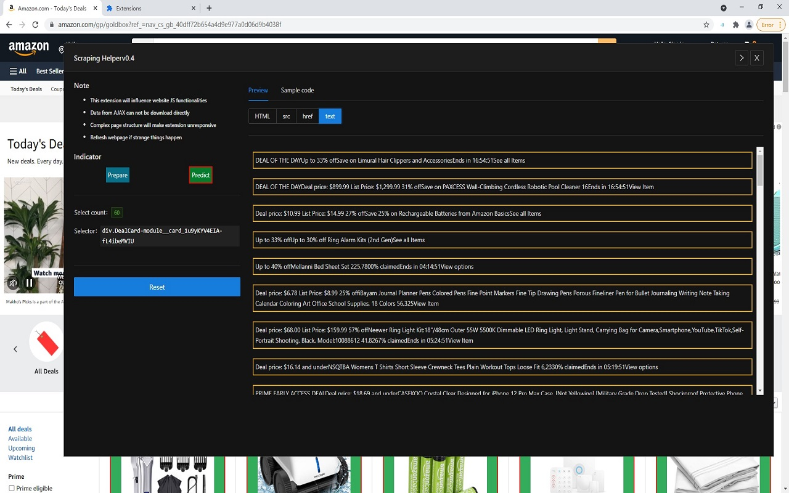

### Version：0.4 Alpha

Link to [Chrome Store](https://chrome.google.com/webstore/detail/%E6%95%B0%E6%8D%AE%E6%8A%93%E5%8F%96%E5%88%86%E6%9E%90%E5%B7%A5%E5%85%B7/kmghfpaenbmakjffjhjncacmhagadgbg?hl=zh-CN)

# 数据抓取分析助手 (Chrome 插件版)

根据选择元素，自动生成最简 HTML 选择命令，用于爬虫网页内容分析

## 功能：

- 自动生成最简 HTML 选择命令，用于爬虫网页内容分析
- 查看选择元素属性
- 生成参考代码

# Scaping Helper

Automatically generate CSS selector for web structure analysis

## Feature

- Automatically generate CSS selector for web structure analysis
- Inspect element attributes
- Generate reference code

  
  
  
  

MIT LICENSE
Contributor LordBread
